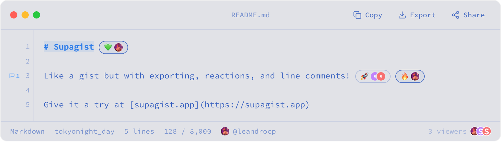
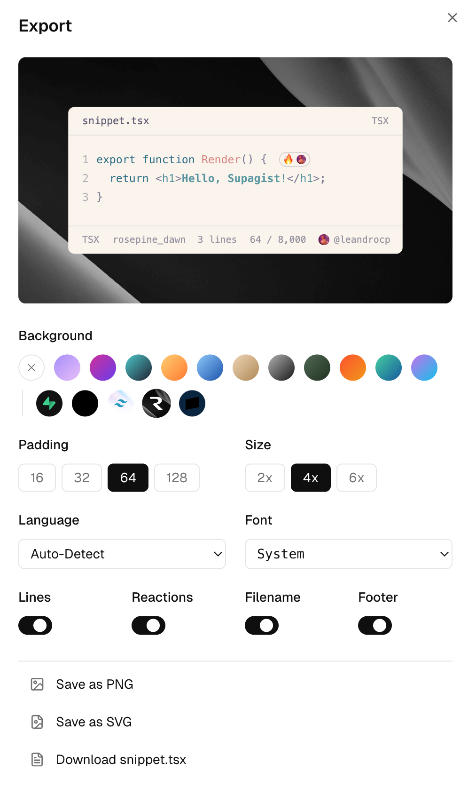

# Supagist

Share a code snippet. Reactions and comments on every line.



Live at **[supagist.app](https://supagist.app)**

## Features

- Per-line reactions. Click a line, pick an emoji. Other readers' reactions show next to yours.
- Per-line comments. Each line gets its own thread.
- Live presence. The status bar shows who's reading the snippet right now.
- Syntax highlighting via [Lumis](https://lumis.sh). 100+ languages, plenty of themes.
- Export as PNG or SVG, with optional gradient backgrounds and font choices.
- Sign in with GitHub or email. Reading is free; reacting and commenting need an account.

<p align="center"></p>

## Run locally

```bash
git clone https://github.com/leandrocp/supagist
cd supagist
mise install
mise run setup
mise run dev
```

App runs on `http://localhost:3000`. Studio at `http://127.0.0.1:54323`.

For GitHub OAuth in dev, set `SUPABASE_AUTH_GITHUB_CLIENT_ID` and `SUPABASE_AUTH_GITHUB_SECRET` in your shell. Or skip it and use email/password.

## Tests

```bash
mise run test
mise run test:integration
mise run test:e2e
```

## How it works

See [ARCHITECTURE.md](./ARCHITECTURE.md) for auth states, realtime channels, storage layout, the export pipeline, and URL design.

## License

MIT.
